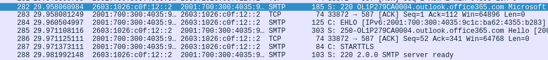
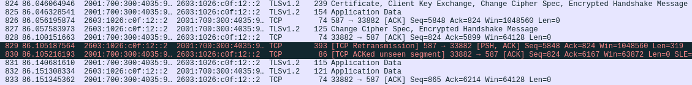

# Outlook over firebird
the server-address of the email is outlook.office365.com and sends the data over TLS.
The address where the TLS data is sent is 143.204.55.45, which is a cloud-centre in oslo. Upon further
inspection we find that that the SMTP port to outlook.office365.com is 567, with the transfer having
the following frames: 

after the initial smtp-setup, the transfer continues over TLS and is encrypted 
(under you see the initial handshake and first frames of the transfer):


# Results from email_check

```console
---Scanning ibm.com---
ipv4s:  129.42.38.10
ipv6s: 

---reverse lookup---
Reverse lookup of 129.42.38.10:  None found

---mx servers---
mx0a-001b2d01.pphosted.com.
mx0b-001b2d01.pphosted.com.

---spf lookup---
_spf.google.com
_netblocks.google.com
_netblocks2.google.com
_netblocks3.google.com

---Scanning statoil.no---
ipv4s:  140.86.60.34
ipv6s: 

---reverse lookup---
Reverse lookup of 140.86.60.34:  None found

---mx servers---
statoil-no.mail.protection.outlook.com.

---spf lookup---
spf.protection.outlook.com
spfd.protection.outlook.com

---Scanning google.com---
ipv4s:  172.217.21.142
ipv6s:  2a00:1450:400f:80d::200e

---reverse lookup---
Reverse lookup of 172.217.21.142:  arn11s02-in-f14.1e100.net. fra07s63-in-f142.1e100.net.
Reverse lookup of 2a00:1450:400f:80d::200e:  arn09s20-in-x0e.1e100.net.

---mx servers---
alt4.aspmx.l.google.com.
alt3.aspmx.l.google.com.
aspmx.l.google.com.
alt2.aspmx.l.google.com.
alt1.aspmx.l.google.com.

---spf lookup---
_spf.google.com
_netblocks.google.com
_netblocks2.google.com
_netblocks3.google.com


```